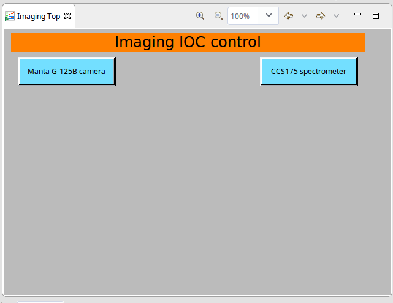

# Imaging IOC

EPICS IOC to support __Allied Vision Technologies Manta G125B__ GigE camera and __Thorlabs CCS175__ spectrometer.

Based on EPICS [areaDetector 3.1](http://cars9.uchicago.edu/software/epics/areaDetector.html).

Provided bash scripts:

	ng3esetup.sh        setup the environment (user changes may be required)
	start_ioc.sh        starts the ioc
	init_ioc.sh         init some ioc PVs to defaults

TODO:

* enable autosave
